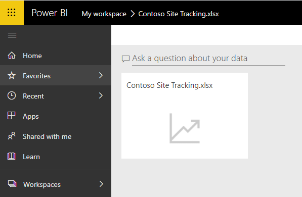
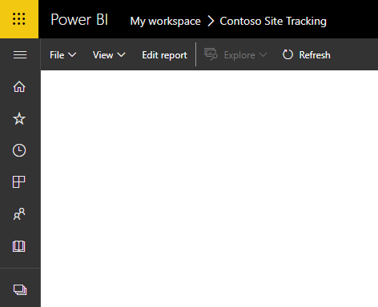
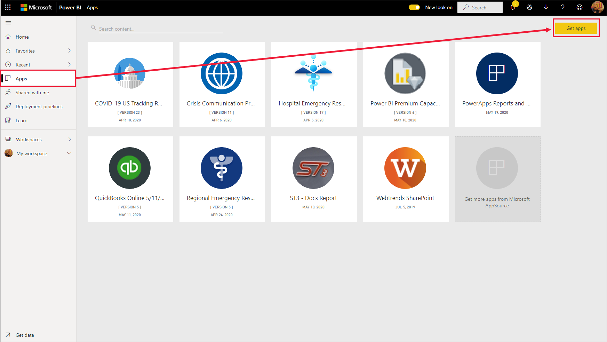
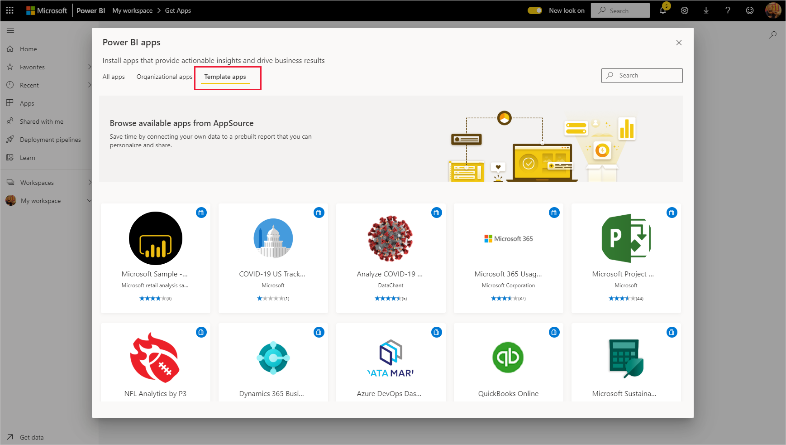
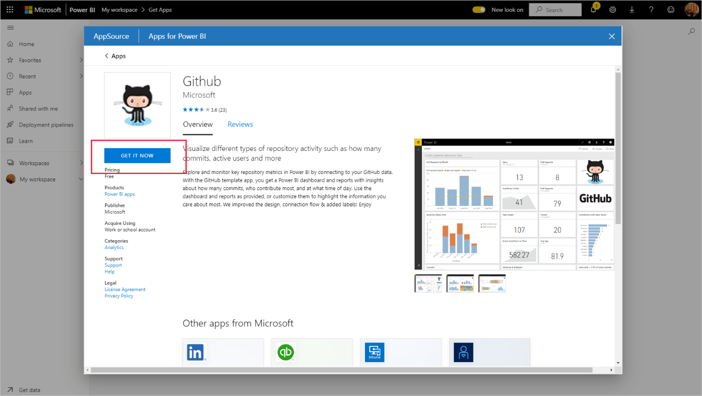
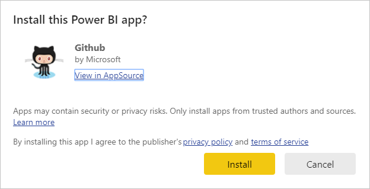
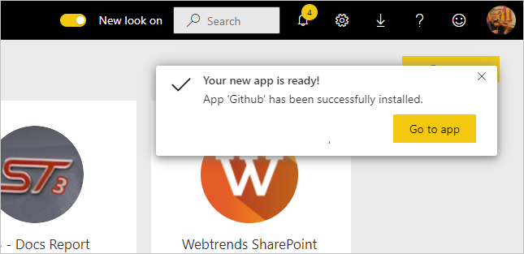

From customer and employee data, metrics for company goals, to sales and acquisitions, business are drowning in data, but this data is only as good as your ability to interpret and communicate its meaning. That's where Power BI (Business Intelligence) comes into play. 

Microsoft Power BI is a collection of software services, apps, and connectors that work together to turn your unrelated sources of data into coherent, visually immersive, and interactive insights. Whether your data is a simple Microsoft Excel workbook, or a collection of cloud-based and on-premises hybrid data warehouses, Power BI lets you easily connect to your data sources, clean, and model your data without affecting the underlying source, visualize (or discover) what's important, and share that with anyone or everyone you want.

## The parts of Power BI

Power BI consists of a Microsoft Windows desktop application called Power BI Desktop, an online SaaS (Software as a Service) service called the Power BI service, and mobile Power BI apps that are available on phones and tablets.

These three elements — Desktop, the service, and Mobile apps—are designed to let people create, share, and consume business insights in the way that serves them, or their role, most effectively.

## Power BI concepts

The major building blocks of Power BI are: *datasets, reports,* and *dashboards*.
They are all organized into *workspaces*, and they are created on *capacities*.

## Capacities

Capacities are a core Power BI concept representing a set of resources used to host and deliver your Power BI content.
Capacities are either *shared* or *dedicated*. A shared capacity is shared with
other Microsoft customers, while a dedicated capacity is fully committed to a
single customer. Dedicated capacities require a subscription. By default,
workspaces are created on a shared capacity.

## Workspaces

Workspaces are containers for dashboards, reports, datasets, and
dataflows in Power BI. There are two types of workspaces: *My
workspace* and *workspaces*.

-   **My workspace** is the personal workspace for any Power BI customer to work
    with your own content. Only you have access to your My workspace. You can
    share dashboards and reports from your My Workspace. If you want to
    collaborate on dashboards and reports, or create an app, then you want to
    work in a workspace.

-   **Workspaces** are used to collaborate and share content with colleagues. You
    can add colleagues to your workspaces and collaborate on dashboards,
    reports, and datasets. With one exception, all workspace members
    need Power BI Pro licenses.

Workspaces are also the places where you create, publish, and
    manage *apps* for your organization. Think of workspaces as staging areas
    and containers for the content that will make up a Power BI app. So what is
    an *app*? An app is a collection of dashboards and reports built to deliver
    key metrics to the Power BI consumers in your organization. Apps are
    interactive, but consumers cannot edit them. App consumers, the colleagues
    who have access to the apps, do not necessarily need Pro licenses.

## Datasets

A **dataset** is a collection of data that you *import* or *connect* to. Power BI
lets you connect to and import all sorts of datasets and bring all of it
together in one place. Datasets can also source data from dataflows.

Datasets are associated with *workspaces* and a single dataset can be part of
many workspaces. When you open a workspace, the associated datasets are listed
under the **Datasets** tab. Each listed dataset represents a collection of
data, for example, a dataset can contain data from an Excel workbook on OneDrive, an on-premises SSAS tabular
dataset, and/or a Salesforce dataset. There are many different data sources
supported. Datasets added by one
workspace member are available to the other workspace members with
an *admin*, *member*, or *contributor* role.

## Shared Datasets

Business intelligence is a collaborative activity. It's important to establish
standardized datasets that can be the 'one source of truth.' Discovering
and reusing those standardized datasets is key. When expert data modelers in
your organization create and share optimized datasets, report creators can start
with those datasets to build accurate reports. Your organization can have
consistent data for making decisions, and a healthy data culture. 
To consume these shared datasets just
choose **Power BI datasets** when creating your Power BI report.

## Reports

A Power BI report is one or more pages of visualizations such as line charts,
maps, and treemaps. Visualizations are also called **visuals**. You can create
reports from scratch within Power BI, import them with dashboards that
colleagues share with you, or Power BI can create them when you connect to
datasets from Excel, Power BI Desktop, databases, and SaaS applications. For
example, when you connect to an Excel workbook that contains Power View sheets,
Power BI creates a report based on those sheets. And when you connect to a SaaS
application, Power BI imports a pre-built report.

There are two modes to view and interact with reports: **Reading view** and **Editing view**. When you open a report, it opens in Reading view. If
you have edit permissions, then you see **Edit report** in the upper-left
corner, and you can view the report in Editing view. If a report is in a
workspace, everyone with an *admin, member, or contributor* role can edit it.
They have access to all the exploring, designing, building, and sharing
capabilities of Editing view for that report. The people they share the report
with can explore and interact with the report in Reading view.

When you open a workspace, the associated reports are listed under
the **Reports** tab. Each listed report represents one or more pages of
visualizations based on only one of the underlying datasets. To open a report,
select it.

When you open an app, you are presented with a dashboard. To access an
underlying report, select a dashboard tile (more on tiles later) that was pinned
from a report. Keep in mind that not all tiles are pinned from reports, so you
may have to click a few tiles to find a report.

By default, the report opens in Reading view. Just select **Edit report** to
open it in Editing view (if you have the necessary permissions).

## Dashboards

A *dashboard* is something you create **in the Power BI service** or something a
colleague creates **in the Power BI service** and shares with you. It is a
single canvas that contains zero or more tiles and widgets. Each tile pinned
from a report or from Q&A displays a single visualization that was created from
a dataset and pinned to the dashboard. Entire report pages can also be pinned to
a dashboard as a single tile. There are many ways to add tiles to your
dashboard; too many to be covered in this overview topic.

Why do people create dashboards? Here are just some of the reasons:

-   to see, in one glance, all the information needed to make decisions.

-   to monitor the most-important information about your business.

-   to ensure all colleagues are on the same page, viewing and using the same
    information.

-   to monitor the health of a business or product or business unit or marketing
    campaign, etc.

-   to create a personalized view of a larger dashboard and show all the metrics
    that matter to them.

When you open a workspace, the associated dashboards are listed under
the **Dashboards** tab. To open a dashboard, select it. When you open an app,
you will be presented with a dashboard. If you own the dashboard, you will also
have edit access to the underlying dataset(s) and reports. If the dashboard was
shared with you, you will be able to interact with the dashboard and any
underlying reports but will not be able to save any changes.

## Template Apps

The new Power BI *template apps* enable Power BI partners to build Power BI apps
with little or no coding and deploy them to any Power BI customer. As a Power BI
partner, you create a set of out-of-the-box content for your customers and
publish it yourself.

You can build template apps that allow your customers to connect within their own accounts. 
As domain experts, they can unlock the data in a way that is easy for their business users to consume. 

Template apps are submitted to the Partner center to become publicly available in the [Power BI Apps
marketplace](https://app.powerbi.com/getdata/services) and on [Microsoft
AppSource](https://appsource.microsoft.com/?product=power-bi). If you're
interested in creating template apps yourself for distribution outside your
organization, see [Create a template app in Power
BI](https://docs.microsoft.com/power-bi/connect-data/service-template-apps-create). 

### Install a template app
--------------------------

1.  In the nav pane in the Power BI service, select **Apps** \> **Get apps**.

    

2.  In the Power BI apps marketplace that appears, select **Template apps**. All
    the template apps available in AppSource will be shown. Browse to find the
    template app you're looking for, or get a filtered selection by using the
    search box.

    

3.  When you find the template app you're looking for, click it. The template app offer will display. Click **GET IT NOW**.

    

4.  In the dialog box that appears, select **Install**.

    

The app is installed, along with a workspace of the same name that has all
the artifacts needed for
further [customization](/power-bi/connect-data/service-template-apps-install-distribute#customize-and-share-the-app).

>![NOTE]
>   If you use an installation link for an app that isn't listed on AppSource, a
>   validation dialog box will ask you to confirm your choice.

>   To be able to install a template app that is not listed on AppSource, you
>   need to request the relevant permissions from your admin. See the [Template
>   app
>   settings](https://docs.microsoft.com/power-bi/admin/service-admin-portal#template-apps-settings) in
>   Power BI admin portal for details.

When the installation finishes successfully, a notification tells you that
your new app is ready.

