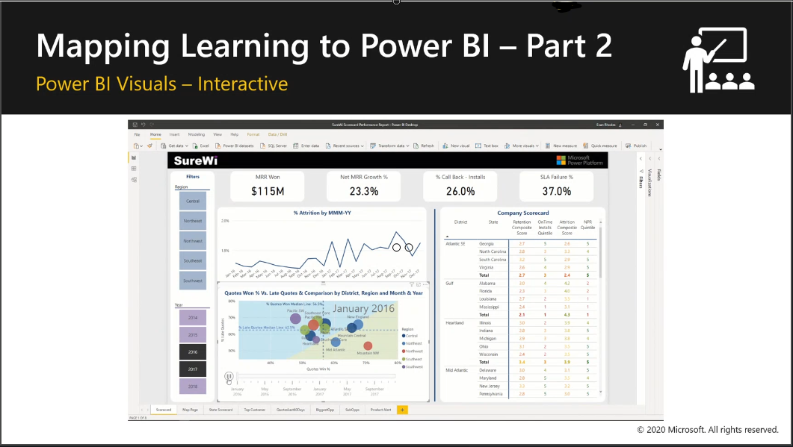

## Power BI Visuals
In this section you will show the interactivity of visuals across a Power BI report page. Visuals allow us to present a complete story of our data while also allowing report users to explore and consume the insights dynamically. 

> [!TIP]
> Your students have just finished their lunch, so they will be relaxed and may not be paying close attention. For that reason, we start with Power BI visuals and an example where things move on the screen. You may also need to encourage them to re-engage.

### Video
> [!VIDEO https://www.microsoft.com/videoplayer/embed/RE4IAZT] 
> In this 11-minute video Krissy Dyes explains how to teach and run the demonstration in the Power BI visuals section. 

## Power BI Security
Power BI gives us new and better ways to secure our data with Row Level Security (RLS)!
- Limits the data shown in reports based on the individual user
- Prevents users from seeing data they are not supposed to see

> [!TIP]
> Depending on your audience, you may want to emphasize or minimize the section on setting up row level security. With higher level Analysts this will be important, but for lower level analysts awareness that row level security is possible may be sufficient.

### Video
> [!VIDEO https://www.microsoft.com/videoplayer/embed/RE4ID4r]
> In this 6-minute video Krissy Dyess explains how to teach the Security section.
