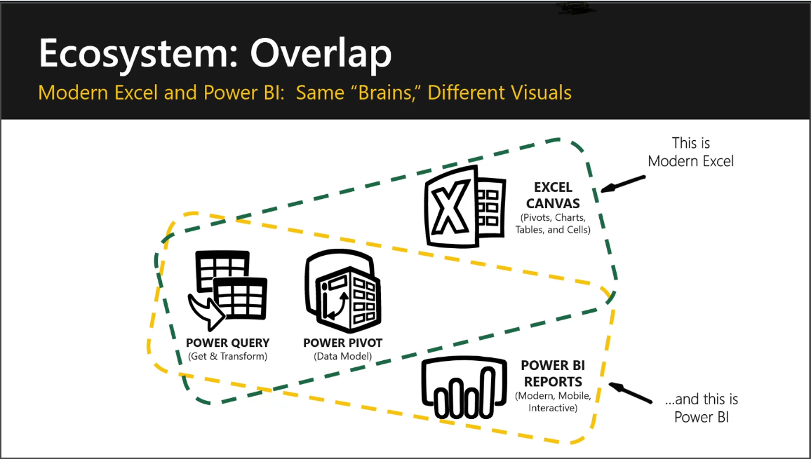

In this module, you have learned how to teach the **Power BI and Excel better togehter** module of instructor-led course **Modern Excel Analyst in a day** to your Data Analyst customers.
You now have the skills, knowledge, and resources to help your students use what they already know about Excel and extend that knowledge into Power BI Desktop.

In this module you’ve learned how to explain some of the ways that you can use Power BI & Excel together right now. 

You learned how to deliver:
- Power BI & Excel better together - Ecosystem
- Connecting to Power BI from Excel
- Cube Formulas
- Microsoft Information Protection/Row Level Security (RLS)
 - Roadmap
 - Featured Tables
 - Data Types
 - Lineage

## Resources
The files required to teach the instructor-led course **Modern Excel Analyst in a day** are located here:
    - [Instructor](https://assetsprod.microsoft.com/mpn/en-us/maiad-instructor.zip)
    - [Attendee](https://assetsprod.microsoft.com/mpn/en-us/maiad-attendee.zip)

These resources from the instructor-led course will help your students better understand Modern Excel.  
They will also allow you to provide additional information when you are explaining these topics to your customers.

> [!TIP]
> Take a moment to visit these sites, review their content, and bookmark them for future use.