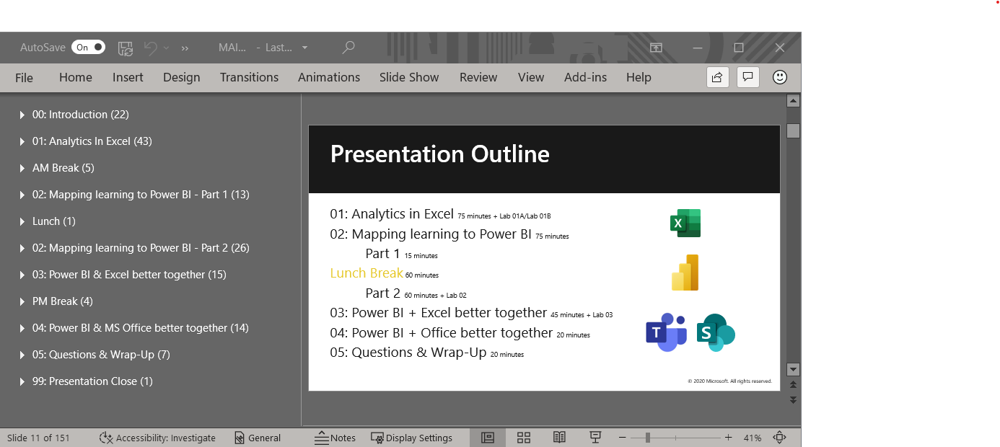

To help your customers gain the full power of Excel and Power BI, you will need to provide some of them with technical training on how to use modern Excel analytics. 

This train-the-trainer course will prepare you to deliver **Power BI & Office Better Together** module of the **Modern Excel Analyst in a day** instructor-led course. This course will take your customers on a journey in Excel to Power BI Desktop and then to Power BI Service, and will help alleviate their data analysis concerns and move your sales forward.

Depending on your customers’ needs you may want to deliver this module by itself, or with some or all of the other modules in the “Modern Excel Analyst in a day” course to help close sales.

## Learning objectives
In this module you will learn how to deliver the Instructor-led module on **Power BI & Office Better Together** that covers how Power BI integrates seamlessly with MS Office Teams & SharePoint Online.

The other modules in the **Prepare to teach: Modern Excel Analyst in a day** course will give you the skills and knowledge to explain and demonstrate how to:
1. Setup Power Query & Power Pivot in Excel
1. Use Power Query & Power Pivot in Excel to improve efficiency, provide reusable seamless solutions and transform existing manual reporting into actionable insights
1. Understand how Excel maps into Power BI Desktop
1. Identify opportunities to use Excel & Power BI together
1. **Integrate Excel & Power BI solutions into Microsoft Teams & SharePoint (This module)**
1. Identify when to use Excel, Power BI, or both together.

## To take this module
This module consists of 14 slides and should take 20 minutes to deliver. 

This course is a mix of text, videos, labs, resources, and quizzes. 
- The text provides tips and guidance on how to deliver this course.
- In the videos, Krissy Dyess from Power Pivot Pro, takes you through the course and shows you how to explain and demonstrate combining Excel and Power BI.
- The labs will help you practice using Excel and Power BI so you can better demo to your customers.
- The resources will help you guide your customers to additional information during and after the sales process.
- The quizzes will help you identify key messages and possible disconnects for your customers.

> [!TIP]
> Tip In addition to taking notes on the content, take notes on what worked with Krissy Dyess’ delivery, and where you would do things differently. 

## To receive credit 
Visit all of the pages in this train-the-trainer module and complete all the knowledge checks to receive credit for this train-the trainer course.

Watching the videos, practicing the labs, and visiting the resources are highly recommended but not required. 

## Video
> [!VIDEO https://www.microsoft.com/videoplayer/embed/RE4IHZS] 
> In this 2-minute video Krissy Dyess explains how to introduce this next to the last module in the course.
