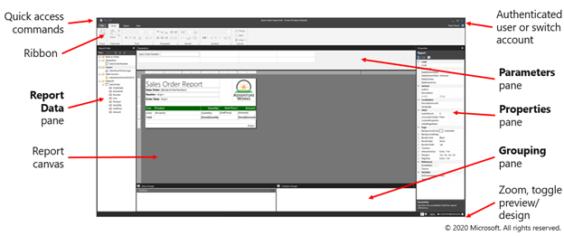
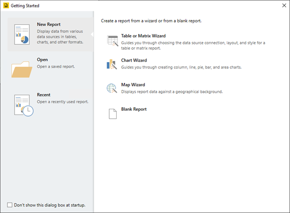

## Video: Designing Report Layouts - Part 1

In this 16-minute video, Peter Myers and Chris Finlan introduce Report Builder and describe a general development methodology for:
- Designing report layouts 
- Setting dynamic properties

 
> [!NOTE]
> Report builder is a tool for developers. It is not intended to be used as a report consumption tool.
> The goal is to create the report for use on the service.

> [!VIDEO https://www.youtube.com/embed/EjHANN3rGNs]

## Video: Designing Report Layouts - Part 2

In this 6-minute video, Peter Myers and Chris Finlan demonstrate creating a first report by using a wizard.

> [!TIP]
> If you can use one of your student's existing report format as a guide, you'll reduce their concern that Paginated reports won't fit into their organization. 
 

> [!VIDEO https://www.youtube.com/embed/EjHANN3rGNs]