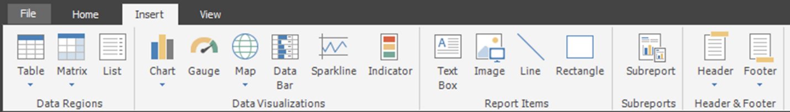
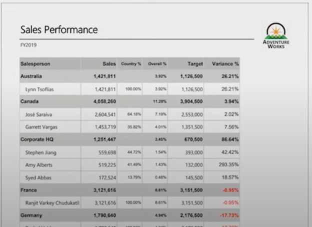

## Video 14: Visualizing Report Data - Part 1
In this 11-minute video, Peter Myers and Chris Finlan introduce the data region and data visualization templates you can use to visualize report data. Then they dive into each of the data region templates.

The Insert ribbon tab contains three templates for data regions:
- Table
- Matrix
- List

> [!TIP]
> This first section of the module is just a review of visualizations in general. Make sure you've covered the concepts before diving into how to actually create visualizations. 

**View the video here.**  
[https://www.youtube.com/embed/b4TxBBtOWSw](https://www.youtube.com/embed/b4TxBBtOWSw?azure-portal=true)

## Video 15: Visualizing Report Data - Part 2
In this 26-minute video, Peter Myers and Chris Finlan demonstrate creating a table report.

> [!TIP]
> This is a 20-minute demo, so come back to the table report view a couple times during the demo to remind your students of what you are doing and how your changes will impact the user.

**View the video here.**  
[https://www.youtube.com/embed/JhEa_TugXeE](https://www.youtube.com/embed/JhEa_TugXeE?azure-portal=true)