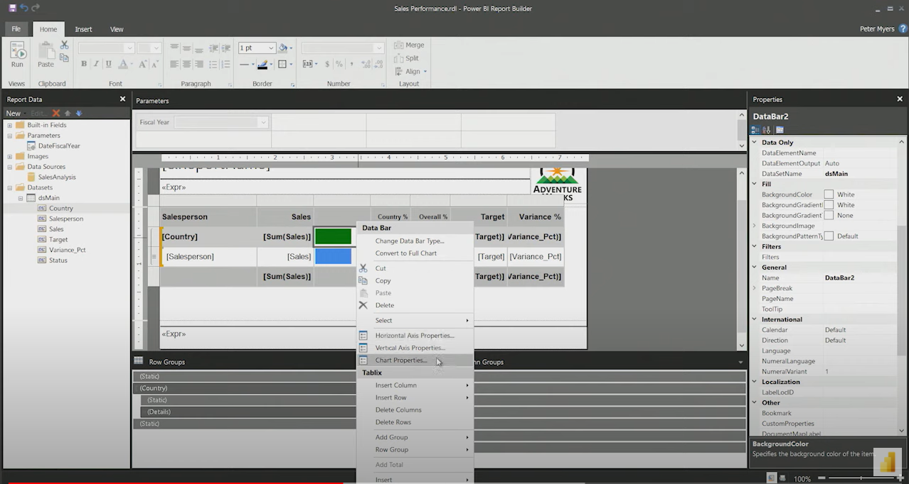

## Video  16: Visualizing Report Data - Part 3
In this 4-minute video, Peter Myers and Chris Finlan introduce the data visualization templates. 

> [!NOTE]
> Unlike flexible grid layouts, the visualization is fixed in dimensions.  

The **Insert** ribbon tab contains six templates to visualize data:
- Chart
- Gauge
- Map
- Data bar
- Sparkline
- Indicator

> [!TIP]
> Your students may know these visualizations by different names so take a moment to describe or show each of the templates.

**View the video here.**  
[https://www.youtube.com/embed/dliLsRvQB-c](https://www.youtube.com/embed/dliLsRvQB-c?azure-portal=true)

## Video 17: Visualizing Report Data - Part 4
In this 8-minute video, Peter Myers and Chris Finlan demonstrate adding data bars and indicators to the table report.

> [!CAUTION]
> At 3-minutes into the video, the discussion of a chart inside a text box is a major area of confusion for new visualization developers. 

**View the video here.**  
[https://www.youtube.com/embed/5yHxuRRP_eU](https://www.youtube.com/embed/5yHxuRRP_eU?azure-portal=true)