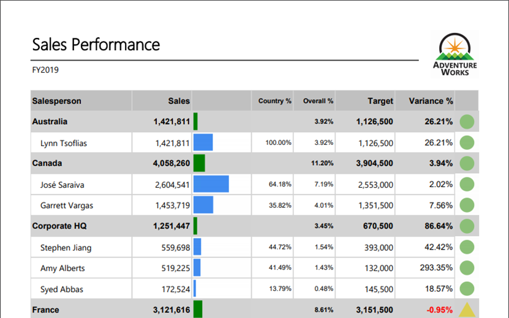

In this 20-minute lab your students will add data visualizations to the Table Report that you created in the prior labs.

Your student's tasks in this lab are to:
1.	Add data bars
2.	Add indicators

> [!WARNING]
> You must successfully complete Lab 05A before commencing this lab

Lab document available at <CourseFolder>\PowerBIPRIAD\Lab05B

The final report will look like the following:

> [!Tip]
> Depending on the skill level of your students, you may want to deliver this as an instructor-led lab to help them get though the steps smoothly.
